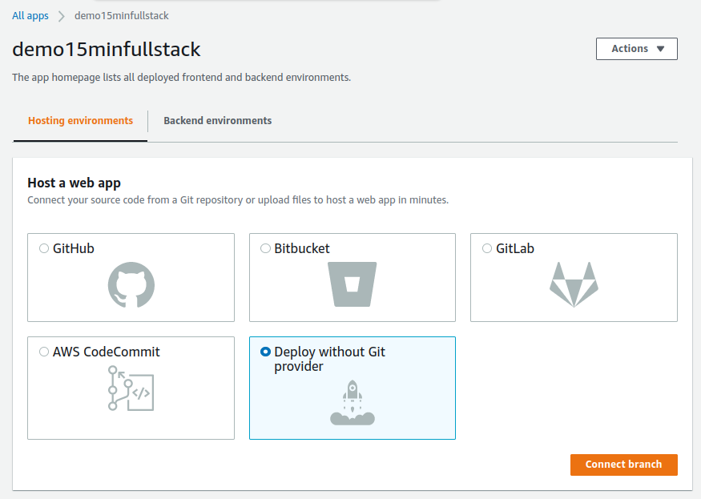
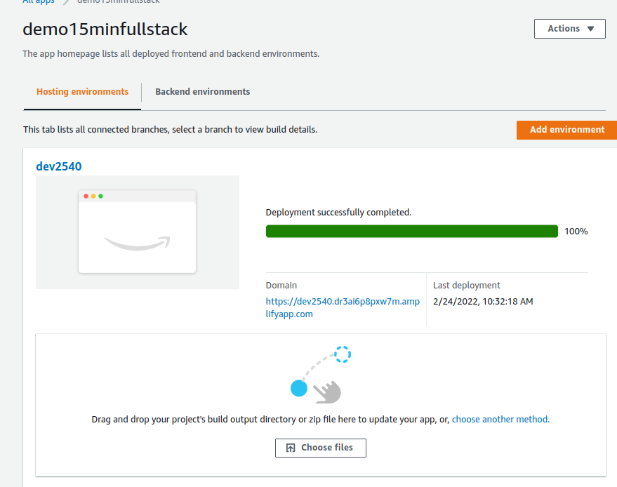

# What dis?

This is a guide for how you quickly can set up a fullstack web application. In this guide
we'll build a simple text-messages application. We'll go through every step how how to set
up a frontend, api endpoint, a database and deploying it all to production in about 15
minutes (what?!).

You'll be on your own with creating your UI. But, there are a few useful components in `src/ui/`
that you can copy paste in to your project ;).

If you haven't used react before, make sure you try a plain react project before you follow this
guide!

[Tutorial: Intro to React](https://reactjs.org/tutorial/tutorial.html)

# Prerequisites

- Install node https://nodejs.org/en/download/
- Install yarn. If you prefer to use npm instead of yarn, I probably don't need to tell you how to
  modify this guide :).
  ```
  npm install --global yarn
  ```
- Set up an initial react project
  ```bash
  npx create-react-app@latest demo-15min-fullstack --template typescript
  ```
- Install amplify + some other tools we'll need
  ```bash
  yarn add aws-amplify aws-amplify-react uuid
  ```
- Install amplify CLI
  ```bash
  npm install -g @aws-amplify/cli
  ```

# Configure AWS

First, we'll need to configure our AWS account to set up the backend

1. In the root of your project, run
   ```bash
   amplify configure
   ```
1. Log in to your aws account (create one if you need to).
1. Go back to the terminal hit enter.
1. Select your region (I used eu-north-1 for Sweden).
1. Choose a username (I used amplify-fullstack-demo).
1. You'll be sent back to the browser. Leave everything as is and click next until your user is
   created.
1. On the last screen, you'll get your access credentials. Make sure you save these before you close
   the browser!
1. Go back to the terminal, hit enter, and enter your new credentials.
1. (optional) Set a profile name for your account.

# Initialize Amplify

1. Run
   ```bash
   amplify init
   ```
1. Leave all settings as is and hit enter.
1. Select the authentication method `AWS profile`.
1. Choose your profile (default if you didn't set one earlier).

Nice! You've created your initial backend! You can run `amplify status` to see information about it
(for now, it will be pretty empty).

# Create Graphql API

1. Run
   ```bash
   amplify add api
   ```
1. Choose GraphQL and blank schema. Leave everything else as default.
1. When asked if you want to edit your schema, say yes.
1. Add the following to your schema file:

   ```graphql
   enum MessageType {
     MESSAGE
   }

   type Message @model {
     id: ID!
     clientId: ID
     createdAt: AWSDateTime!
     type: MessageType!
       @index(
         name: "messagesByDate"
         queryField: "messagesByDate"
         sortKeyFields: ["createdAt"]
       )
     message: String!
     name: String!
   }
   ```

   This file can always be found in `amplify/backend/api/demo15minfullstack/schema.graphql`

1. Run `amplify mock api` to generate and start a local API server. I chose Typescript for
   programming language and kept everything else as default.
1. Run `amplify push` to create and deploy your dev server!

# Let's create a web app!

1. In `App.tsx`, add

   ```typescript
   import Amplify from "aws-amplify";
   import config from "./aws-exports";

   Amplify.configure(config);
   ```

   Now the app can use the api.

1. Fetching existing message with the following code

   ```typescript
   import { graphqlOperation, GraphQLResult } from "@aws-amplify/api-graphql";
   import { messagesByDate } from "./graphql/queries";
   import {
     MessagesByDateQuery,
     Message,
     MessagesByDateQueryVariables,
     ModelSortDirection,
     MessageType,
   } from "./API";

   const fetchMessagesRequest = async () => {
     try {
       const vars: MessagesByDateQueryVariables = {
         type: MessageType.MESSAGE,
         // Grab only 50 messages.
         limit: MAX_MESSAGES,
         // Sort them so we get the 50 latest message.
         sortDirection: ModelSortDirection.DESC,
       };
       // Do this actual request.
       const messagesResult = (await API.graphql(
         graphqlOperation(messagesByDate, vars)
       )) as GraphQLResult<MessagesByDateQuery>;
       console.log("fetched messages:", messagesResult.data);

       // Get the messages from the request result. Fallback to empty array.
       const messages = messagesResult.data?.messagesByDate?.items ?? [];
       // The messages are now in the reverse order. Let's fix that!
       messages.reverse();

       return messages;
     } catch (error) {
       console.log("fetch messages error:", error);
     }
   };
   ```

   Now we can fetch the messages inside of app

   ```typescript
   import { Message } from "./API"; // On top of file

   // Inside of function App
   const [messages, setMessages] = useState<Message[]>([]);
   // Fetch initial messages
   useEffect(() => {
     (async () => {
       const messages = await fetchMessagesRequest();
       if (!messages) return;
       setMessages(
         // Graphql can return null if there is something corrupt about a message.
         // This can happen if the schema has changed but the database hasn't been migrated.
         messages.filter(
           <T extends any>(msg: T | null | undefined): msg is T => !!msg
         )
       );
     })();
   }, []);
   ```

   Messages are now in `messages`. It's up to you how you want to render them! Check out `src/ui`
   if you want to reuse some prebuilt components.

1. To send new message, we create a similar request:

   ```typescript
   import { CreateMessageInput, CreateMessageMutation } from "./API";

   import { createMessage } from "./graphql/mutations";

   const sendMessageRequest = async (input: CreateMessageInput) => {
     try {
       (await API.graphql(
         graphqlOperation(createMessage, { input })
       )) as GraphQLResult<CreateMessageMutation>;
       console.info("Sent message: ", input.message);
     } catch (error) {
       console.error("Send message error: ", error);
     }
   };
   ```

   Again, you can reuse UI the components in `src/ui` if you want!

1. Right now, we have to refresh the entire app to see new messages. Even the ones we sent. Let's
   fix that!

   ```typescript
   import Observable from "zen-observable-ts";
   import { onCreateMessage } from "./graphql/subscriptions";
   import { OnCreateMessageSubscription, CreateMessageMutation } from "./API";

   // In App
   useEffect(() => {
     // Subscribe to incoming messages.
     const subscription = (
       API.graphql(graphqlOperation(onCreateMessage)) as Observable<{
         value?: { data?: OnCreateMessageSubscription };
       }>
     ).subscribe({
       // We've received a new message!
       next: ({ value }) => {
         console.info("Received: ", value);
         // Get the message from the event.
         const message = value?.data?.onCreateMessage;
         // Just like when we fetch the full list, broken messages can be null.
         // Let's ignore those
         if (!message) return;
         setMessages((msgs) =>
           // Append the message to the list
           [...msgs, message]
             // Only keep 50 messages. The 50 latest specifically
             .slice(-MAX_MESSAGES)
         );
       },
     });

     // Unsubscribe when the component is unmounted
     return () => subscription.unsubscribe();
   }, []);
   ```

1. Probably, you want to scroll to the bottom of the message list when new
   messages arrive. This code solves that

   ```typescript
   useEffect(() => {
     if (!name) return;
     if (!messages) return;

     document.documentElement?.scrollIntoView({
       behavior: "auto",
       block: "end",
       inline: "nearest",
     });
   }, [messages, name]);
   ```

And that's it! We're ready to deploy!

# Deployment

1. If you didn't run `amplify push` before, you'll need to that first. This will deploy the API
2. Build your project with `yarn build`. This will create a folder `build/` with all the compiled
   frontend files that we will upload.
3. Run `amplify console` and choose `AWS console`.
4. In the browser, go to you app, choose hosting environments and then deploy without a git provider.
   
5. Drag and drop your newly created build folder over to the AWS console in your browser.
   Hit save and deploy.
6. Now grab the URL under `Domain`, send it to your friends and try it out!
   

Any time you change you API, do step 1 again. If you change your UI, repeat the steps 2-5!
